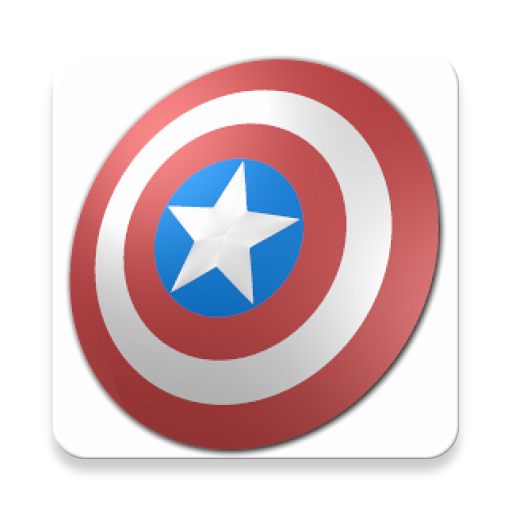

# Avengers! Comics

Avengers comics shows a list of comics from Captain America

This project uses Material design with *Clean architecture* by means of *Model-View-Presenter (MVP)* with *Repository pattern*
as well as `Dagger 2` for *Dependency Injection*, trying to respect *SOLID principles* as much as possible.

### Logo


## Overview
At this open-source project, it is decoupled between `android` and `domain` modules or high level layers.

This means, `android` is strongly coupled with the Android framework and `domain` is decoupled from it, and can be re-used for other purposes when
required as is purely *Java* based, but not framework coupled.

Inside the those modules, there are some good practices being employed, for instance:
- There is an implementation of the *repository pattern* with a Network datasource (it could be extended to have others if required such as InternetDataSource and so on).

*Retrofit 2* is the Network library which uses *OkHttp* as its client, this makes calls to the API, transforming the responses to models, for this purpose and properly handling
the different requests on background threads with a pool of threads which passes their use cases result and avoids to lock the
UI thread.

## Architecture design overview
The exchange between the different *layers* is as follows:
- **Repository layer**:
  - from the models coming from a concrete *data source* to the *Repository* (repository is the responsible of managing from 1 to n datasources, in this case only network datasource)
  - from the *Repository* to their associated *Interactor* (or use case)
- **Interactor layer**: from the *Interactor*, which is responsible of the *business logic* and communicating results to the *Presenter*
- **Presenter layer**: from the *Presenter*, which provides the final formatted info to a passive `View` from a UI element (fragments / activities).
Finally, this information would be passed through the UI thread.


### Material design
- This code test uses a wide range of Material design widgets from the Design support library such as:
- `AppBarLayout`, `CoordinatorLayout`, `Toolbar`, `RecyclerView`, `CardView` or `CollapsingToolbarLayout` as well as Material theme styles.

### Features
- At the main screen a list of comics from Captain America composed by thumbnail and title (a placeholder is located in case there is no image)
- Once clicked an item, the comic detail view of each comic is shown with an animation, depending if >= Lollipop
- This shows with a Parallax effect an image, then information about the ID, title, description, creators and characters appearing at the comic
- Error handling integrated for `Http` or `Connection` or `IO` issues, also empty state indicating no results when required.
- A Loader is placed each time a new request is started, to indicate the user the fact that there is an action going on
- An infinite scroll (linear one) is able to retrieve more comics by going down on the scroll
- There is a small amount of Unit test cases for the most critical parts: mainly the MD5 validation for the hash (unit test), then presenter and views (callbacks) interaction.
- Following previous statement, extracted from the documentation: hash - a md5 digest of the ts parameter, your private key and your public key (e.g. md5(ts+privateKey+publicKey)

### SDK support
Support SDKs from **16** to **25**

# Disclosure - Libraries used
- [Marvel API](http://developer.marvel.com/) API selected
- [Dagger 2](http://google.github.io/dagger) for Dependency Injection
- [ButterKnife](http://jakewharton.github.io/butterknife) v6.1.0 for Views Injection
- [Retrofit 2](https://github.com/square/retrofit) v2.1.0 for Network requests
- [OkHttp 3](https://github.com/square/okhttp) v3.6.0 as client for Retrofit
- [Picasso](http://square.github.io/picasso/) v2.5.2 for image rendering
- [Mockito](http://site.mockito.org/) for Mocking artifacts
- [JUnit](http://junit.org/) for Unit testing Graph algorithm and its datastructure or rounding.

# References (special thanks) - those are the same I indicated at my personal blog ([Insights and projects](https://raulh82vlc.github.io/Movies-Finder)): 
- [Uncle Bob: The Clean Architecture](https://blog.8thlight.com/uncle-bob/2012/08/13/the-clean-architecture.html) by Uncle Bob
- [The Repository pattern](https://msdn.microsoft.com/en-us/library/ff649690.aspx) by Microsoft
- [Effective Android UI](https://github.com/pedrovgs/EffectiveAndroidUI) by Pedro Gomez
- [Android Clean Architecture](https://github.com/android10/Android-CleanArchitecture) by Fernando Cejas

### Contributions
Please read first [CONTRIBUTING](./CONTRIBUTING.md)

## About the author
**Raul Hernandez Lopez**,
- [Insights and projects (Personal projects blog)](https://raulh82vlc.github.io)
- [@RaulHernandezL (Twitter)](https://twitter.com/RaulHernandezL)
- [raul.h82@gmail.com](mailto:raul.h82@gmail.com)

# License
```
Copyright (C) 2017 Raul Hernandez Lopez

Licensed under the Apache License, Version 2.0 (the "License");
you may not use this file except in compliance with the License.
You may obtain a copy of the License at

http://www.apache.org/licenses/LICENSE-2.0

Unless required by applicable law or agreed to in writing, software
distributed under the License is distributed on an "AS IS" BASIS,
WITHOUT WARRANTIES OR CONDITIONS OF ANY KIND, either express or implied.
See the License for the specific language governing permissions and
limitations under the License.
```
